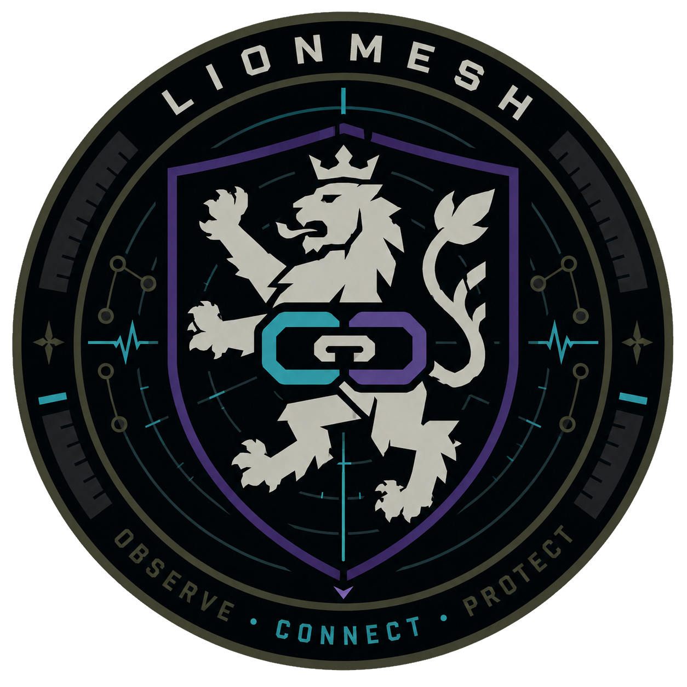

<p align="center">
  
</p>

# LionMesh

**Experimental open-source field mesh platform for off-grid video and data communication.**

No infrastructure. No proprietary radio firmware. No GNU Radio dependency.

[](LICENSE)
[]()
[](STATUS.md)
[]()

---

## What is LionMesh?

LionMesh is an experimental open-source field mesh platform for situations where no fixed communication infrastructure is available: disaster relief, search and rescue, civil protection, tactical training, remote deployments, and resilient field communication experiments.

The project combines two independent communication layers:

- **Control plane** — LoRa 868 MHz via Meshtastic. GPS position broadcasting, node discovery, fallback messaging, and low-bandwidth coordination. Always active regardless of data plane state.
- **Data plane** — either standard WiFi mesh via `batman-adv`, or an experimental custom OFDM PHY over LimeSDR hardware.

A local web interface served by each node displays known nodes, GPS positions, link quality, MCS, and video status.

LionMesh is designed to be understandable, modifiable, and field-testable by technical users. The current focus is credibility, reproducibility, and step-by-step validation rather than claiming finished MANET-radio performance.

---

## Current project status

LionMesh is **not yet a finished operational tactical MANET**. It is a research and prototyping platform.

| Area | Status |
|---|---|
| Node daemon + REST API | Implemented / prototype |
| WebApp (Leaflet map, node list, video panel) | Implemented / prototype |
| WiFi mesh via `batman-adv` | Intended first deployable mode |
| LoRa / Meshtastic control plane | Implemented, hardware validation required |
| OFDM PHY — TX/RX simulation | Implemented, all MCS pass in AWGN |
| OFDM PHY — CFO tracking (pilot-based) | Implemented |
| OFDM PHY — frame fragmentation | Implemented |
| OFDM PHY — adaptive bitrate (MCS→encoder) | Implemented |
| MAC QoS — 3-priority queue (control/video/data) | Implemented |
| Encryption — ECIES per-node keypair | Implemented |
| Encryption — WireGuard VPN layer | Setup script provided |
| LimeSDR over-the-air validation | Not yet performed |
| Multi-node routing over SDR PHY | Future work |

For the detailed validation matrix, see [STATUS.md](STATUS.md).

---

## Why LionMesh?

Commercial tactical MANET radios such as Silvus StreamCaster or Persistent Systems MPU5 are powerful, but they are expensive, closed systems and difficult to study or modify.

LionMesh explores a transparent alternative using accessible hardware and open software:

- Raspberry Pi as compute platform
- Meshtastic / LoRa as resilient low-bandwidth control plane
- WiFi mesh as practical first data plane
- LimeSDR as experimental SDR data plane
- Web-based observability for node state, position, and radio information

The goal is not to instantly replace commercial MANET radios. The goal is to build a reproducible open platform that can be studied, tested, extended, and improved.

---

## Architecture

```text
┌─────────────────────────────────────────────────────────────────┐
│                        WebApp  :8080                            │
│     Leaflet map · Node list · MCS/RSSI · Video panel            │
├─────────────────────────────────────────────────────────────────┤
│                     Node Daemon  (FastAPI)                      │
│         REST API · Node registry · Radio/status API             │
├───────────────────────────┬─────────────────────────────────────┤
│      Control plane        │          Data plane                 │
│                           │                                     │
│  LoRa 868 MHz             │  Standard WiFi mesh                 │
│  Meshtastic firmware      │  batman-adv / 802.11                │
│  GPS position broadcast   │  first practical deployment mode    │
│  Node discovery           │                                     │
│  Fallback messaging       │  — or —                             │
│                           │                                     │
│                           │  Experimental LionMesh OFDM PHY     │
│                           │  LimeSDR Mini 2 / XTRX              │
│                           │  2.4 GHz recommended                │
│                           │  863 MHz only with authorisation    │
└───────────────────────────┴─────────────────────────────────────┘
```

Both planes operate independently. Losing the data plane does not disable LoRa discovery and messaging.

---

## Recommended development path

1. **Local daemon test** — run FastAPI node daemon and WebApp on one machine.
2. **Two-node WiFi mesh** — validate `batman-adv`, node registry, API, and WebApp with standard WiFi.
3. **LoRa control plane** — validate Meshtastic GPS discovery between real nodes.
4. **PHY simulation** — run OFDM self-tests without hardware (`python phy/phy_ofdm.py`).
5. **SDR loopback** — test LionMesh PHY with controlled LimeSDR loopback.
6. **Short-range over-the-air test** — validate CFO tracking, timing, and packet recovery.
7. **Field tests** — document real ranges, throughput, packet loss, antenna setup, and regulatory constraints.

---

## Hardware

### Per node

| Component | Purpose | Required |
|---|---|---|
| Raspberry Pi 4B or CM4 | Main compute | Yes |
| Seeed WM1302 LoRa HAT | Control plane 868 MHz | Recommended |
| GPS module | Position tracking | Recommended |
| UPS / battery board | Field power | Recommended |
| Alfa USB WiFi adapter | WiFi data plane | Mode: `wifi` |
| LimeSDR Mini 2 or XTRX | Experimental SDR data plane | Mode: `lionmesh` |
| 3D-printed enclosure | Field housing | Recommended |

The LimeSDR is optional. Set `mode = wifi` in `node.conf` to run with a standard WiFi adapter.

---

## Radio modes

| Mode | Frequency | Status | Notes |
|---|---|---|---|
| `wifi` | 2.4 / 5 GHz | Practical first mode | batman-adv, no LimeSDR |
| `lionmesh` | 2.4 GHz | Experimental | Recommended for SDR tests |
| `lionmesh` | 863 MHz | Restricted | Authorisation required (see Regulatory) |

Range and throughput depend heavily on antenna, transmit power, channel conditions, and hardware maturity. All SDR figures are simulation targets until field-validated.

---

## LionMesh PHY

The experimental SDR PHY is a custom OFDM transceiver written in Python. It is intended for learning, testing, and field validation.

### Signal processing pipeline

```text
TX:
  Payload → CRC32 → Scrambler → Conv. encoder K=7 → Puncturing
  → Bit interleaver → QAM modulator → OFDM (IFFT + CP) → Preamble → IQ

RX:
  IQ → Schmidl-Cox coarse sync → LTF cross-correlation fine timing
  → LS channel estimation → ZF equaliser
  → CFO tracking (pilot-based, per-symbol phase correction)
  → Soft LLR demodulation → Bit deinterleaver
  → Soft Viterbi decoder → Descrambler → CRC check
```

### OFDM parameters

| Parameter | Value |
|---|---|
| FFT size | 64 |
| Data subcarriers | 48 |
| Pilot subcarriers | 4 (positions ±7, ±21) |
| Cyclic prefix | 16 samples (25%) |
| Sample rate | 5 / 10 / 20 MS/s (matches channel BW) |

### MCS table

The following values are simulation targets. Real-world results require hardware validation.

| MCS | Modulation | Code rate | 5 MHz | 10 MHz | 20 MHz | Min SNR |
|---|---|---|---|---|---|---|
| 0 | BPSK | 1/2 | 1.5 Mbps | 3 Mbps | 6 Mbps | 8 dB |
| 1 | QPSK | 1/2 | 3 Mbps | 6 Mbps | 12 Mbps | 10 dB |
| 2 | QPSK | 3/4 | 4.5 Mbps | 9 Mbps | 18 Mbps | 13 dB |
| 3 | 16-QAM | 1/2 | 6 Mbps | 12 Mbps | 24 Mbps | 16 dB |
| **4** | **16-QAM** | **3/4** | **9 Mbps** | **18 Mbps** | **36 Mbps** | **19 dB** |
| 5 | 64-QAM | 2/3 | 12 Mbps | 24 Mbps | 48 Mbps | 23 dB |
| 6 | 64-QAM | 3/4 | 13.5 Mbps | 27 Mbps | 54 Mbps | 25 dB |

### Channel bandwidth

| BW | SNR gain vs 20 MHz | MCS4 throughput | Notes |
|---|---|---|---|
| 5 MHz | +6 dB | 9 Mbps | Best range — default |
| 10 MHz | +3 dB | 18 Mbps | Balanced |
| 20 MHz | — | 36 Mbps | Maximum throughput |

### MAC layer

The MAC layer provides:

- **3-priority TX queue** — Control frames (ACK/NACK/PROBE) always preempt video and data. Based on the Doodle Labs URLLC principle.
- **Datagram mode** — fire-and-forget for video RTP packets (no ACK, drop on congestion).
- **Stop-and-wait ARQ** — reliable transfer with ACK and retry for data.
- **Adaptive MCS** — link layer adjusts modulation based on ACK/NACK statistics.
- **Frame fragmentation** — payloads larger than 4092 bytes (e.g. H.265 I-frames up to 50 KB) are automatically split and reassembled.

### Adaptive bitrate

`VideoTX` monitors the current MCS every 2 seconds and adjusts the H.265 encoder bitrate dynamically. When the link degrades, the encoder reduces bitrate before the MAC queue fills — preventing stutter and dropped frames.

| MCS | PHY throughput | Encoder target | Resolution |
|---|---|---|---|
| 0 | 1.5 Mbps | — (no video) | — |
| 1 | 3 Mbps | 1.2 Mbps | 480p |
| 3 | 6 Mbps | 2.4 Mbps | 720p |
| **4** | **9 Mbps** | **3.6 Mbps** | **720p** |
| 6 | 13.5 Mbps | 5.4 Mbps | 1080p |

*(Values at 5 MHz bandwidth. Scale proportionally for 10/20 MHz.)*

---

## Encryption

LionMesh implements two-layer encryption for PPDR and sensitive deployments.

### Layer 1 — MAC frame encryption (AES-256-GCM)

Every PHY frame payload is encrypted at the MAC layer. Works without IP connectivity.

**Scheme:** ECIES — Elliptic Curve Integrated Encryption

| | Unicast frames | Broadcast frames |
|---|---|---|
| Key | Recipient's Curve25519 public key | Group PSK (shared) |
| ECDH | Curve25519, ephemeral per frame | — |
| KDF | HKDF-SHA256 | PBKDF2-SHA256 |
| Cipher | AES-256-GCM | AES-256-GCM |
| Overhead | 60 bytes | 28 bytes |
| Forward secrecy | ✅ new ephemeral keypair per frame | ❌ |

Key management:
- Each node generates a Curve25519 keypair automatically on first start
- Public keys are exchanged via `GET /api/crypto/pubkey` and `POST /api/crypto/peers`
- Keys are persisted in `/etc/lionmesh/keys/`

### Layer 2 — WireGuard VPN

End-to-end tunnel over the batman-adv mesh IP, protecting application traffic.

- Curve25519 key exchange, ChaCha20-Poly1305 encryption
- WireGuard subnet: `10.42.0.0/24` over batman-adv `10.41.0.0/16`
- Setup: `sudo bash setup/05_wireguard.sh --node-id 1 --peer-ip 10.41.0.2 --peer-key <pubkey>`

Enable encryption in `node.conf`:

```ini
[crypto]
enabled    = true
key_dir    = /etc/lionmesh/keys
group_psk  = shared-broadcast-passphrase
group_salt = lionmesh-ppdr-2026
```

---

## Software stack

```text
lionmesh/
├── phy/
│   ├── phy_ofdm.py      OFDM PHY — TX/RX, sync, CFO tracking, FEC, Viterbi
│   ├── mac_simple.py    MAC — 3-priority queue, ARQ, fragmentation, crypto
│   ├── xtrx_radio.py    SoapySDR interface + AWGN simulation fallback
│   ├── video_pipe.py    H.265 pipeline + adaptive bitrate control
│   └── crypto.py        ECIES per-node keypair + AES-256-GCM
│
├── control/
│   ├── lora.py          Meshtastic interface
│   ├── gps.py           gpsd position reader
│   └── mesh.py          batman-adv helpers
│
├── daemon/
│   ├── main.py          Entry point — orchestrates all subsystems
│   ├── api.py           FastAPI REST API + WebApp + crypto key exchange
│   ├── radio.py         Radio abstraction — LionMesh PHY or WiFi
│   └── registry.py      Node registry (LoRa + data plane combined)
│
├── webapp/
│   ├── templates/       index.html — Leaflet map, node list, video panel
│   └── static/          app.js, style.css
│
├── config/
│   └── node.conf.example
│
└── setup/
    ├── 01_system.sh
    ├── 02_mesh_wifi.sh
    ├── 03_lora_meshtastic.sh
    ├── 04_lionmesh.sh
    └── 05_wireguard.sh
```

---

## Setup

### Requirements

- Raspberry Pi 4B or CM4
- Raspberry Pi OS Lite 64-bit
- Python 3.10+
- Internet connection for initial setup

### Installation

```bash
git clone https://github.com/daviddoerfel/lionmesh
cd lionmesh

sudo bash setup/01_system.sh
sudo bash setup/02_mesh_wifi.sh
sudo bash setup/03_lora_meshtastic.sh
sudo bash setup/04_lionmesh.sh        # asks about LimeSDR + GStreamer
```

### Configuration

```bash
sudo nano /etc/lionmesh/node.conf
```

Minimum example:

```ini
[node]
node_id   = lionmesh-a
node_name = LION-ALPHA
mesh_ip   = 10.41.0.1

[radio]
mode         = wifi
bandwidth_hz = 5000000
mcs          = 4
freq_hz      = 2400000000

[lora]
lora_port = /dev/ttyAMA0
```

### Start

```bash
sudo systemctl start lionmesh
sudo systemctl status lionmesh
sudo journalctl -u lionmesh -f
```

### Access

```text
http://<node-ip>:8080
```

---

## PHY self-test

No SDR hardware required:

```bash
pip install -r requirements.txt
python phy/phy_ofdm.py
```

---

## API reference

| Method | Endpoint | Auth | Description |
|---|---|---|---|
| GET | `/` | — | WebApp |
| GET | `/api/status` | — | Local node: GPS, radio, uptime |
| GET | `/api/nodes` | — | All known nodes (LoRa + data plane) |
| GET | `/api/radio` | — | Radio link quality |
| POST | `/api/config` | Basic | Runtime config update |
| POST | `/api/video/start` | Basic | Start video TX |
| POST | `/api/video/stop` | Basic | Stop video TX |
| GET | `/api/crypto/pubkey` | — | This node's Curve25519 public key |
| GET | `/api/crypto/peers` | — | List registered peer node IDs |
| POST | `/api/crypto/peers` | Basic | Register a peer public key |

---

## Roadmap

### Near-term validation

- [ ] Two-node WiFi mesh test report
- [ ] Meshtastic GPS discovery test report
- [ ] LimeSDR loopback test report
- [ ] Short-range over-the-air SDR packet test
- [ ] Measured throughput and packet-loss table
- [ ] Antenna and power documentation
- [ ] Screenshots from real local demo

### PHY / SDR work

- [ ] IQ imbalance correction
- [ ] Hardware validation on real LimeSDR
- [ ] Field measurements at 2.4 GHz
- [ ] batman-adv integration for SDR data plane
- [ ] WebRTC bridge for in-browser video RX
- [ ] 2×2 MIMO spatial multiplexing

### Security / operational hardening

- [ ] Replace default admin password flow
- [ ] Add local firewall guidance
- [ ] Add deployment checklist
- [ ] Add offline documentation bundle

---

## Regulatory notice

LionMesh is an experimental open-source radio project. The operator is responsible for ensuring legal operation in their jurisdiction.

**2.4 GHz** — Recommended frequency for all development and testing. No duty cycle restriction. Subject to local power and antenna rules (ETSI EN 300 328, max 100 mW EIRP in EU).

**863 MHz / 868 MHz** — EU Sub-GHz ISM band (ETSI EN 300 220). Maximum 1% duty cycle. Channel bandwidth is limited to 200 kHz–1 MHz in the standard band plan — wideband OFDM operation at this frequency falls outside normal licence-free operation. Use only in authorised contexts: emergency services, civil protection, or controlled test environments where the operator has confirmed legal authorisation. In Luxembourg, 862 MHz is allocated to LUMICC/PPDR services.

**5 GHz** — Not supported. The LMS7002M chipset has a hard maximum of 3.8 GHz.

---

## Security notice

LionMesh is not hardened for hostile networks by default. Before any operational deployment, review:

- admin password handling
- API access control and exposure
- mesh network access control
- local firewall configuration
- video stream access
- physical device security
- encryption key management
- radio regulatory compliance

Do not expose the node daemon directly to the public internet.

---

## License

MIT License — Copyright (c) 2026 David Doerfel

Free to use, modify, and distribute — including for emergency services, civil protection, public-safety research, and technical education.
