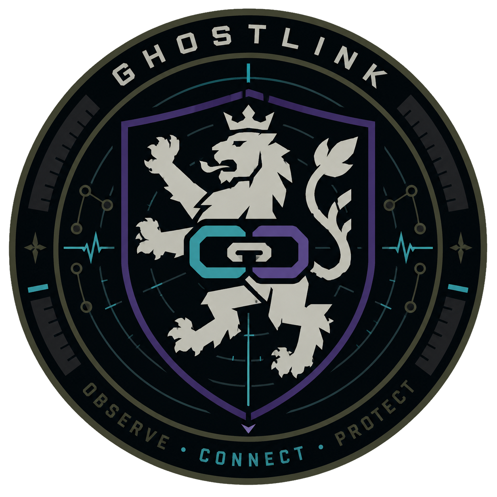

<div align="center">



# GhostLink

**Field mesh radio for off-grid video communication.**

No infrastructure. No proprietary hardware. No GNU Radio required.

[](LICENSE)
[]()
[]()

</div>

---

## What is GhostLink?

GhostLink is a self-contained mesh radio system designed for field operations where no infrastructure exists — disaster relief, search and rescue, off-grid deployments.

It runs on Raspberry Pi hardware and combines two communication layers:

- **Control plane** — LoRa 868 MHz via Meshtastic. Handles GPS position broadcasting, node discovery, and fallback messaging. Always active, extremely low power, works at multi-kilometre range.
- **Data plane** — Either a custom OFDM PHY over LimeSDR (the GhostLink PHY), or standard 802.11 WiFi via batman-adv. Carries HD video, files, and the management web interface.

A web interface accessible from any node in the mesh shows all nodes on a live map, their positions from GPS, link quality, and a video feed.

---

## Why GhostLink?

Commercial MANET radios like the Persistent Systems MPU5 or Silvus StreamCaster do exactly this — but cost €15,000–€40,000 per unit and are closed systems. GhostLink is an open-source attempt to close that gap with accessible hardware.

The GhostLink PHY is a custom OFDM transceiver written from scratch in Python. It implements the full signal processing chain: Schmidl-Cox synchronisation, least-squares channel estimation, zero-forcing equalisation, convolutional FEC with soft-decision Viterbi decoding, and adaptive modulation from BPSK to 64-QAM. No GNU Radio. No pre-built SDR stack.

---

## Architecture

```
┌─────────────────────────────────────────────────────────────────┐
│                        WebApp  :8080                            │
│             Leaflet map · Node list · Video panel               │
├─────────────────────────────────────────────────────────────────┤
│                     Node Daemon  (FastAPI)                      │
│         REST API · Node registry · Band switching               │
├───────────────────────────┬─────────────────────────────────────┤
│      Control plane        │          Data plane                 │
│                           │                                     │
│  LoRa 868 MHz             │  GhostLink OFDM PHY                 │
│  Meshtastic firmware      │    LimeSDR Mini 2 or XTRX           │
│  GPS position broadcast   │    863 MHz / 2400 MHz               │
│  Node discovery           │    5 / 10 / 20 MHz bandwidth        │
│  Fallback text messaging  │    MCS 0–6 · up to 54 Mbps          │
│                           │    H.265 video · RTP                │
│                           │                                     │
│                           │  — or —                             │
│                           │                                     │
│                           │  Standard WiFi (batman-adv)         │
│                           │    Any 802.11 adapter               │
│                           │    No LimeSDR required              │
├───────────────────────────┼─────────────────────────────────────┤
│  Seeed WM1302 LoRa HAT   │  LimeSDR Mini 2 / XTRX              │
│  u-blox GPS module        │  — or — Alfa WiFi adapter           │
└───────────────────────────┴─────────────────────────────────────┘
```

Both planes operate independently. Losing the WiFi / LimeSDR link does not affect LoRa, and vice versa. Nodes continue exchanging positions and short messages over LoRa even when the data plane is down.

---

## Hardware

### Per node

| Component | Purpose | Required |
|---|---|---|
| Raspberry Pi 4B or CM4 | Main compute | Always |
| Seeed WM1302 LoRa HAT | Control plane 868 MHz | Always |
| u-blox GPS module | Position tracking | Always |
| UPS / battery board | Field power | Always |
| **LimeSDR Mini 2** or **XTRX** | GhostLink data plane | Mode: `ghostlink` |
| Alfa USB WiFi adapter | Standard WiFi data plane | Mode: `wifi` |
| 3D-printed enclosure | Field housing | Recommended |

The [OpenNot5 enclosure](https://makerworld.com/de/models/2128181-openmanet-radio-case) is a 3D-printable, field-ready case for Raspberry Pi MANET radios with 4× SMA ports and a waterproof USB-C charge port.

### The LimeSDR is optional

Set `mode = wifi` in `node.conf` to run without a LimeSDR. The entire system — LoRa control plane, GPS, node registry, WebApp, batman-adv mesh — works with a standard WiFi adapter. The GhostLink OFDM PHY is only used in `mode = ghostlink`.

### LimeSDR frequency range

The LMS7002M chipset covers 30 MHz to 3.8 GHz. **5 GHz is not supported** — hardware limitation. GhostLink uses 863 MHz (EU Sub-GHz ISM) and 2400 MHz.

---

## Radio modes

| Mode | Freq | BW | Regulatory | Range (omni) | MCS4 | Video |
|---|---|---|---|---|---|---|
| `wifi` | 2.4 / 5 GHz | — | ✅ Legal | 100–400 m | ~20 Mbps netto | ✓ |
| `ghostlink` | 2400 MHz | 5 MHz | ✅ Legal | 800 m–2 km | 9 Mbps | ✓ 720p |
| `ghostlink` | 2400 MHz | 10 MHz | ✅ Legal | 400 m–1 km | 18 Mbps | ✓ 1080p |
| `ghostlink` | 2400 MHz | 20 MHz | ✅ Legal | 200–500 m | 36 Mbps | ✓ 1080p |
| `ghostlink` | 863 MHz | 5 MHz | ⚠️ Grey zone | **2–5 km** | 9 Mbps | ✓ 720p |

The 5 MHz channel gives a **+6 dB SNR gain** over 20 MHz at the same TX power — roughly twice the range. This is the same principle used by Doodle Labs Mesh Rider radios.

**For maximum range:** 863 MHz + 5 MHz BW + MCS 4 = 9 Mbps, 2–5 km. Use only in authorised deployments (emergency services, civil protection) where regulatory flexibility applies.

**For legal general use:** 2400 MHz + 5 MHz BW + MCS 4 = 9 Mbps, 800 m–2 km. No duty cycle restriction, no special authorisation required.

**On 863 MHz (EU Sub-GHz ISM):** ETSI EN 300 220 limits channel bandwidth to 200 kHz–1 MHz and enforces a 1% duty cycle. A 5 MHz channel is already outside the standard band plan. GhostLink enforces the duty cycle automatically via `DualBandRadio`, but channel bandwidth compliance remains the operator's responsibility.

---

## GhostLink PHY

### OFDM parameters

| Parameter | Value |
|---|---|
| FFT size | 64 |
| Data subcarriers | 48 |
| Pilot subcarriers | 4 (positions ±7, ±21) |
| Cyclic prefix | 16 samples (25%) |
| Symbol duration | 80 samples |
| Sample rate | 5 / 10 / 20 MS/s (matches channel BW) |
| Subcarrier spacing | 78.1 / 156.3 / 312.5 kHz |

### MCS table

Throughput scales linearly with bandwidth. All values are net data rate after FEC overhead.

| MCS | Modulation | Code rate | Min SNR | 5 MHz | 10 MHz | 20 MHz |
|-----|-----------|-----------|---------|-------|--------|--------|
| 0 | BPSK | 1/2 | 8 dB | 1.5 | 3 | 6 Mbps |
| 1 | QPSK | 1/2 | 10 dB | 3 | 6 | 12 Mbps |
| 2 | QPSK | 3/4 | 13 dB | 4.5 | 9 | 18 Mbps |
| 3 | 16-QAM | 1/2 | 16 dB | 6 | 12 | 24 Mbps |
| **4** | **16-QAM** | **3/4** | **19 dB** | **9** | **18** | **36 Mbps** |
| 5 | 64-QAM | 2/3 | 23 dB | 12 | 24 | 48 Mbps |
| 6 | 64-QAM | 3/4 | 25 dB | 13.5 | 27 | 54 Mbps |

**Recommended default:** 863 MHz · 5 MHz BW · MCS 4 → 9 Mbps, ~2 km range, sufficient for 720p H.265 at 6–8 Mbps.

### Signal processing pipeline

```
TX path:
  Payload → CRC32 → Scrambler → Conv. encoder (K=7) → Puncturing
  → Bit interleaver → QAM modulator → OFDM (IFFT + CP) → Preamble → IQ

RX path:
  IQ → Schmidl-Cox coarse sync → LTF cross-correlation fine timing (±0 samples)
  → LS channel estimation → ZF equaliser → Soft LLR demodulation
  → Bit deinterleaver → Soft Viterbi decoder → Descrambler → CRC check
```

### Forward error correction

- Convolutional code K=7, NASA polynomials G0=0o171, G1=0o133
- Puncturing for rates 3/4 (`[1,1,1,0,0,1]`) and 2/3 (`[1,1,1,0]`)
- Soft-decision Viterbi with LLR branch metrics — punctured positions receive LLR=0 (erasure)
- Max-Log-MAP soft demodulation for all constellations

---

## Software stack

```
ghostlink/
├── phy/                    GhostLink OFDM PHY
│   ├── phy_ofdm.py         TX/RX, sync, channel estimation, FEC, Viterbi
│   ├── mac_simple.py       MAC — ARQ, datagram mode, adaptive MCS
│   ├── xtrx_radio.py       SoapySDR interface + AWGN simulation fallback
│   └── video_pipe.py       H.265 GStreamer pipeline + RTP fragmentation
│
├── control/                Control plane
│   ├── lora.py             Meshtastic interface — GPS broadcast, discovery
│   ├── gps.py              gpsd position reader
│   └── mesh.py             batman-adv status and band switching
│
├── daemon/                 Node daemon (fusion layer)
│   ├── main.py             Entry point — orchestrates all subsystems
│   ├── api.py              FastAPI REST API + WebApp serving
│   ├── radio.py            Radio abstraction — GhostLink PHY or WiFi
│   └── registry.py         In-memory node registry (LoRa + data plane)
│
├── webapp/                 Web interface
│   ├── templates/          index.html — Leaflet map + node list + video
│   └── static/             app.js, style.css
│
├── config/
│   └── node.conf.example   Configuration template
│
└── setup/                  Raspberry Pi setup scripts
    ├── 01_system.sh
    ├── 02_mesh_wifi.sh
    ├── 03_lora_meshtastic.sh
    ├── 04_ghostlink.sh
    └── 05_webapp.sh
```

---

## Setup

### Requirements

- Raspberry Pi 4B or CM4
- Raspberry Pi OS Lite 64-bit (fresh install)
- Internet connection for initial setup

### Installation

```bash
git clone https://github.com/daviddoerfel/ghostlink
cd ghostlink

sudo bash setup/01_system.sh           # Base system packages
sudo bash setup/02_mesh_wifi.sh        # batman-adv WiFi mesh
sudo bash setup/03_lora_meshtastic.sh  # LoRa + Meshtastic
sudo bash setup/04_ghostlink.sh        # GhostLink daemon + service
                                       # (asks about LimeSDR + GStreamer)
```

### Configuration

```bash
sudo nano /etc/ghostlink/node.conf
```

Minimum required settings:

```ini
[node]
node_id   = ghostlink-a          # unique per node
node_name = GHOST-ALPHA          # display name in WebApp
mesh_ip   = 10.41.0.1           # unique per node (10.41.0.x)

[radio]
mode         = wifi              # wifi or ghostlink
bandwidth_hz = 5000000           # 5, 10, or 20 MHz (ghostlink only)
mcs          = 4                 # 0–6 (ghostlink only)
freq_hz      = 863000000         # 863 or 2400 MHz (ghostlink only)

[lora]
lora_port = /dev/ttyAMA0         # serial port for WM1302 HAT
```

### Start

```bash
sudo systemctl start ghostlink
sudo systemctl status ghostlink
sudo journalctl -u ghostlink -f    # live logs
```

### Access

Open from any device in the mesh:

```
http://<node-ip>:8080
```

Admin endpoints (video TX, config changes) require the password set in `node.conf [api] admin_password`.

---

## Python dependencies

```bash
pip install numpy scipy fastapi uvicorn jinja2 python-multipart meshtastic pyserial gpsd-py3
```

Hardware drivers via apt:

```bash
# LimeSDR Mini 2 / USB:
apt install python3-soapysdr soapysdr-module-lms7

# LimeSDR XTRX:
apt install python3-soapysdr soapysdr-module-xtrx

# H.265 video pipeline:
apt install python3-gst-1.0 gstreamer1.0-plugins-bad gstreamer1.0-libav
```

---

## PHY self-test

Runs a full TX→RX simulation across all bandwidths and MCS levels. No hardware required.

```bash
pip install numpy scipy
python phy/phy_ofdm.py
```

```
GhostLink PHY Self-Test
════════════════════════════════════════════════════════════

  Bandwidth: 5 MHz  |  Sample rate: 5 MS/s  |  SC spacing: 78.1 kHz
  ────────────────────────────────────────────────────────────────────
  MCS0  BPSK   r=0.50   1.5 Mbps   ✓
  MCS4  16QAM  r=0.75   9.0 Mbps   ✓
  MCS6  64QAM  r=0.75  13.5 Mbps   ✓

  Bandwidth: 20 MHz  |  Sample rate: 20 MS/s  |  SC spacing: 312.5 kHz
  ────────────────────────────────────────────────────────────────────
  MCS0  BPSK   r=0.50   6.0 Mbps   ✓
  MCS4  16QAM  r=0.75  36.0 Mbps   ✓
  MCS6  64QAM  r=0.75  54.0 Mbps   ✓
```

---

## API reference

All endpoints are served by the node daemon on port 8080.

| Method | Endpoint | Auth | Description |
|---|---|---|---|
| GET | `/api/status` | — | Local node: GPS, radio mode, uptime |
| GET | `/api/nodes` | — | All known nodes (LoRa + data plane) |
| GET | `/api/radio` | — | Radio link quality (GhostLink mode) |
| POST | `/api/video/start` | Admin | Start video TX |
| POST | `/api/video/stop` | Admin | Stop video TX |
| POST | `/api/config` | Admin | Update config at runtime |

Example:

```bash
curl http://10.41.0.1:8080/api/nodes
```

```json
{
  "nodes": [
    {
      "node_id": "ghostlink-b",
      "node_name": "GHOST-BRAVO",
      "mesh_ip": "10.41.0.2",
      "lat": 49.6298,
      "lon": 6.1187,
      "online": true,
      "radio_mode": "ghostlink",
      "mcs": 4,
      "throughput_mbps": 9.0,
      "lora_rssi": -82
    }
  ]
}
```

---

## IP addressing

All nodes share a flat `/16` mesh network over batman-adv:

| Range | Usage |
|---|---|
| `10.41.0.0/16` | batman-adv mesh |
| `10.41.0.1` | Node A |
| `10.41.0.2` | Node B |
| `10.41.0.x` | Node x |

Assign `mesh_ip` statically in `node.conf`. The WebApp is reachable at any node's mesh IP on port 8080.

---

## Roadmap

- [x] OFDM PHY — MCS 0–6, soft Viterbi, LTF fine timing
- [x] Configurable channel bandwidth — 5 / 10 / 20 MHz
- [x] LoRa control plane — GPS broadcast, node discovery (Meshtastic)
- [x] Node registry — fuses LoRa + data plane data per node
- [x] Radio abstraction — GhostLink PHY or WiFi, identical API
- [x] FastAPI node daemon — REST API, band switching
- [x] WebApp — Leaflet map, MCS/RSSI per node, video panel
- [x] Systemd service + automated setup scripts
- [ ] Carrier frequency offset (CFO) tracking loop
- [ ] IQ imbalance correction
- [ ] Pilot-based phase tracking
- [ ] 2×2 MIMO spatial multiplexing
- [ ] MRC receive diversity combining
- [ ] Hardware validation on real LimeSDR hardware
- [ ] batman-adv integration for GhostLink data plane routing
- [ ] WebRTC bridge for in-browser video RX

---

## Regulatory

**2400 MHz (2.4 GHz ISM):** No duty cycle restriction. Maximum EIRP is 100 mW (20 dBm) under ETSI EN 300 328. All channel bandwidths (5 / 10 / 20 MHz) are permitted. This is the recommended frequency for general use.

**863 MHz (EU Sub-GHz ISM):** Governed by ETSI EN 300 220. Maximum 1% duty cycle. Channel bandwidth is limited to 200 kHz–1 MHz in the standard band plan — a 5 MHz channel is outside this. Use only in authorised contexts (emergency services, civil protection, closed test environments) where regulatory flexibility applies. GhostLink's `DualBandRadio` class enforces the 1% duty cycle automatically regardless of frequency.

**5 GHz:** Not supported. The LMS7002M has a hard maximum of 3.8 GHz.

---

## License

MIT License — Copyright (c) 2026 David Doerfel

Free to use, modify, and distribute — including for emergency services, civil protection, and public safety applications.
